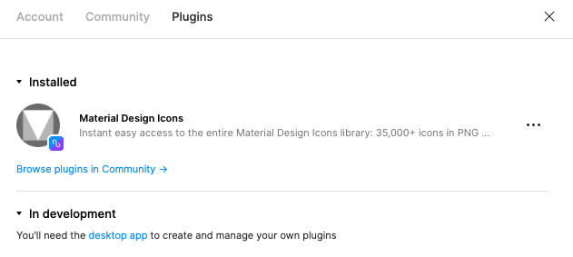

- Needs figma desktop app to create and manage plugins
  - In my machine it was being quite slow
  - Print of Figma: 

- Provides some boilerplate code during creation of plugin on desktop app (code.ts, code.ts, manifest.json, package.json, README.md & tsconfig.json)

- Has it's own typings file (@figma/plugin-typings)
